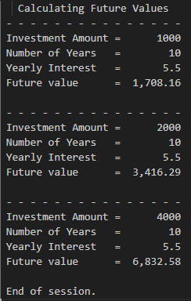

# Developer Portfolio Gateway
**Author:** Dominic Mattern  
**Course:** CIS352 – Intro to Enterprise Computing

---

## 👋 About Me
Welcome to my GitHub portfolio repository. I am currently studying Applied Mathematics at Wayne State College but this repository serves as a directory for my coursework for Intro to Enterprise Computing.

---

# 📚 Table of Contents

| Project Summary | Tech | Category | Description | Repo |
|---------|------|----------|-------------|------|
| [CALC2000](#calc2000) | COBOL & JCL | CIS352 Intro to Enterprise Computing | Calculates future investment values using compound growth and repeated doubling logic | [CALC2000](https://github.com/Dom987554/COBOL-Chapter1-Assignment) |
| [UTIL2000](#util2000) | COBOL & JCL | CIS352 Intro to Enterprise Computing | Generates formatted monthly utility bills based on customer electricy usage with a tiered pricing system | [UTIL2000](https://github.com/Dom987554/COBOL-Chapter2-Assignment)|
| [RPT2000](#rpt2000) | COBOL & JCL | CIS352 Intro to Enterprise Computing | Produces a YTD sales report with comparison to the previous year and percent change calculations | [RPT2000](https://github.com/Dom987554/COBOL-Chapter3-Assignment)|
| [RPT3000](#rpt3000) | COBOL & JCL | CIS352 Intro to Enterprise Computing | Creates a YTD sales reports with customer and branch yearly comparisons and percent change calculations | [RPT3000](https://github.com/Dom987554/COBOL-Chapter4-Assignment)
| [RPT5000](#rpt5000) | COBOL & JCL | CIS352 Intro to Enterprise Computing | Creates a YTD sales report with customer, branch, and salesrep yearly comparisons and precent change calculations | [RPT5000](https://github.com/Dom987554/COBOL-Chapter5-Assignment)|
| [RPT6000](#rpt6000) | COBOL & JCL | CIS352 Intro to Enterprise Computing | Implements table-driven processing with indexed lookups and copybooks for a more flexible file handling| [RPT6000](https://github.com/Dom987554/COBOL-Chapter6-10-11-Assignment)|
| [SEQ3000](#seq3000) | COBOL & JCL | CIS352 Intro to Enterprise Computing | Maintains employee records by processing transactions for add, update, and delete operations | [SEQ3000](https://github.com/Dom987554/COBOL-Chapter13-Assignment)|

---

#Project Summaries

## CALC2000

**Key Concepts:** Arithmetic ops, Data Division handling, Output formatting, Future value calculation, Repeated doubling

**Tech Stack:** 

✅ Completed 
[CALC2000 Repo](https://github.com/Dom987554/COBOL-Chapter1-Assignment)

🔙 [Back to Table of Contents](#-table-of-contents)

---

## UTIL2000

**Key Concepts:** Arithmetic calculations, Conditional logic, Formatted Output, Multi-record Processing

**Tech Stack:** 

✅ Completed 
[UTIL2000 Repo](https://github.com/Dom987554/COBOL-Chapter2-Assignment)

🔙 [Back to Table of Contents](#-table-of-contents)

---

## RPT2000

**Key Concepts:** Date and time acquisition, Percent Calculations File processing, YTD Comparrison

**Tech Stack:** 

✅ Completed 
[RPT2000 Repo](https://github.com/Dom987554/COBOL-Chapter3-Assignment)

🔙 [Back to Table of Contents](#-table-of-contents)

---

## RPT3000

**Key Concepts:** First-record switch, CUSTMAST data file, YTD change amount and Percent

**Tech Stack:** 

✅ Completed 
[RPT3000 Repo](https://github.com/Dom987554/COBOL-Chapter4-Assignment)

🔙 [Back to Table of Contents](#-table-of-contents)

---

## RPT5000

**Key Concepts:** Two-Level control break, EVALUATE, 88-Level condition names, COMPUTE, ROUNDED, ON SIZE ERROR

**Tech Stack:** 

✅ Completed 
[RPT5000 Repo](https://github.com/Dom987554/COBOL-Chapter5-Assignment)

🔙 [Back to Table of Contents](#-table-of-contents)

---

## RPT6000

**Key Concepts:** REDEFINE, Edited Pic Clause, Table Processing with OCCURES and INDEXED BY, COPYLIB

**Tech Stack:** 

✅ Completed 
[RPT6000 Repo](https://github.com/Dom987554/COBOL-Chapter6-10-11-Assignment)

🔙 [Back to Table of Contents](#-table-of-contents)

---

## SEQ3000

**Key Concepts:** Multi-file i/o, Error Handling, Add, Delete, and Update Operations, Generates Updated Master File, VLSM File

**Tech Stack:** 

✅ Completed 
[Seq3000 Repo](https://github.com/Dom987554/COBOL-Chapter13-Assignment)

🔙 [Back to Table of Contents](#-table-of-contents)
