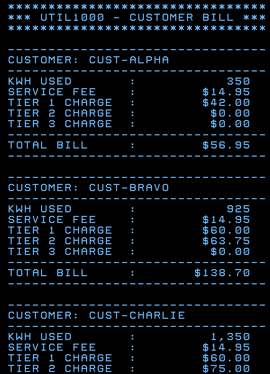
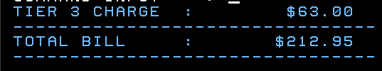
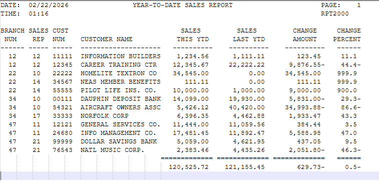
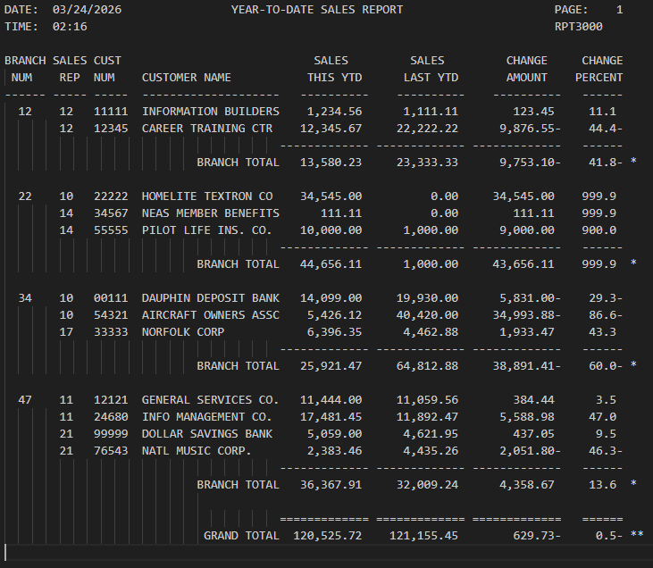
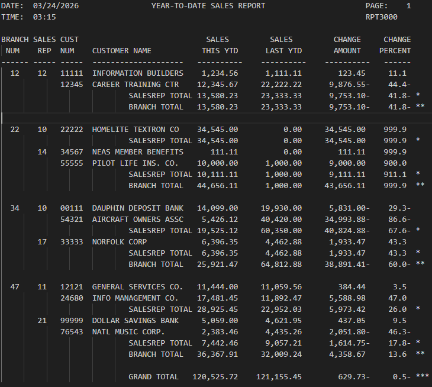
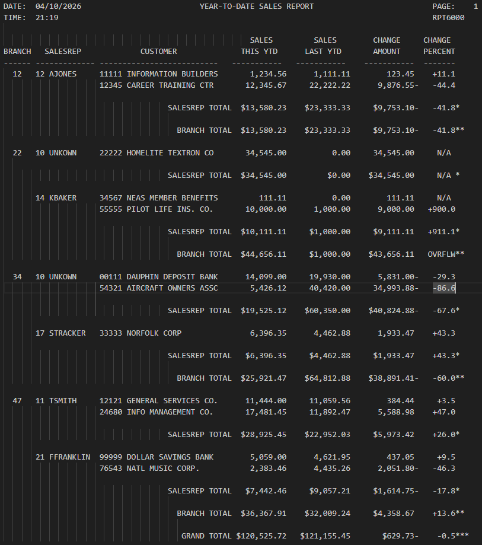
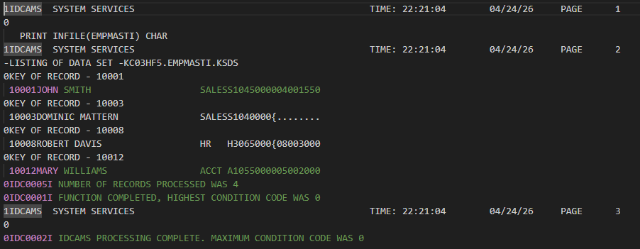

# Developer Portfolio Gateway
**Author:** Dominic Mattern  
**Course:** CIS352 – Intro to Enterprise Computing

---

## 👋 About Me

---

## 📚 Table of Contents

| Project Summary | Tech | Description | Repo |
|---------|------|-------------|------|
| [CALC2000](#calc2000) | COBOL & JCL | Calculates future investment values using compound growth and repeated doubling logic | [CALC2000](https://github.com/Dom987554/COBOL-Chapter1-Assignment) |
| [UTIL2000](#util2000) | COBOL & JCL | Generates formatted monthly utility bills based on customer electricy usage with a tiered pricing system | [UTIL2000](https://github.com/Dom987554/COBOL-Chapter2-Assignment)|
| [RPT2000](#rpt2000) | COBOL & JCL | Produces a YTD sales report with comparison to the previous year and percent change calculations | [RPT2000](https://github.com/Dom987554/COBOL-Chapter3-Assignment)|
| [RPT3000](#rpt3000) | COBOL & JCL | Creates a YTD sales reports with customer and branch yearly comparisons and percent change calculations | [RPT3000](https://github.com/Dom987554/COBOL-Chapter4-Assignment)
| [RPT5000](#rpt5000) | COBOL & JCL | Creates a YTD sales report with customer, branch, and salesrep yearly comparisons and precent change calculations | [RPT5000](https://github.com/Dom987554/COBOL-Chapter5-Assignment)|
| [RPT6000](#rpt6000) | COBOL & JCL | Implements table-driven processing with indexed lookups and copybooks for a more flexible file handling| [RPT6000](https://github.com/Dom987554/COBOL-Chapter6-10-11-Assignment)|
| [SEQ3000](#seq3000) | COBOL & JCL | Maintains employee records by processing transactions for add, update, and delete operations | [SEQ3000](https://github.com/Dom987554/COBOL-Chapter13-Assignment)|

---

## CALC2000

✅ Completed 
[CALC2000 Repo](https://github.com/Dom987554/COBOL-Chapter1-Assignment)

🔙 [Back to Table of Contents](#-table-of-contents)

---

## UTIL2000

✅ Completed 
[UTIL2000 Repo](https://github.com/Dom987554/COBOL-Chapter2-Assignment)

🔙 [Back to Table of Contents](#-table-of-contents)

---

## RPT2000

✅ Completed 
[RPT2000 Repo](https://github.com/Dom987554/COBOL-Chapter3-Assignment)

🔙 [Back to Table of Contents](#-table-of-contents)

---

## RPT3000

✅ Completed 
[RPT3000 Repo](https://github.com/Dom987554/COBOL-Chapter4-Assignment)

🔙 [Back to Table of Contents](#-table-of-contents)

---

## RPT5000

✅ Completed 
[RPT5000 Repo](https://github.com/Dom987554/COBOL-Chapter5-Assignment)

🔙 [Back to Table of Contents](#-table-of-contents)

---

## RPT6000

✅ Completed 
[RPT6000 Repo](https://github.com/Dom987554/COBOL-Chapter6-10-11-Assignment)

🔙 [Back to Table of Contents](#-table-of-contents)

---

## SEQ3000

✅ Completed 
[Seq3000 Repo](https://github.com/Dom987554/COBOL-Chapter13-Assignment)

🔙 [Back to Table of Contents](#-table-of-contents)
